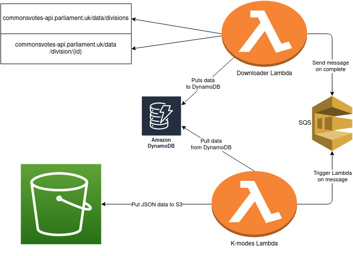

## VoteModes

### TL;DR

This project contains serverless applications that download House of Commons voting data
for use as input to a K-modes clustering algorithm.  

K-modes is implemented using Scala and deployed as an AWS Lambda.  

A Python application - also deployed as an AWS Lambda - performs the download and processing tasks.   

The outputs of the K-modes algorithm are converted to JSON and added to an S3 bucket.
Each application accesses a shared DynamoDB database.  

The above might beg the question: couldn't the whole all these steps be handled by a single app? Answer: yes, but
that's no fun :)

### Infrastructure



### Downloader Lambda

The downloader Lambda fetches data from the House of Common's APIs, then converts
the results to a format suited to the K-modes algorithm. This Lambda is executed once monthly 
using a cron expression.

`divisions_list_downloader.py` handles fetching vote (division in HoC terminology)  
data from the `/divisions` endpoint using helper functions in
`divisions/downloaders.py`. 

Unfortunately, this division data does not contain the vote data for individual MPs, 
only the total for and against counts. 
`votes_per_division_downloader.py` and its helpers in `votes_per_divisions/downloaders.py`
contain code to extract the division ids returned from `/divisions`
for use as inputs for the HoC's `/division/{id}` endpoint.   

To reduce the Lambda's execution time, each divisions' voting data is downloaded in parallel.

The resulting data for each MP is then extracted from these divisions and used to update a 
DynamoDB table, which contains a `Votes` value for each MP represented as a list of mappings
from `DivisionId` -> `Vote` (Aye/No/NoAttend).  

### K-Modes lambda
Why k modes and not kmeans?  
select k, now = 5
Triggered when downloaeder finishes  
Parse db data  
Select starting centroids   
Group by 'distance' -> Reculate using mode -> repeat until stable of max iters  
Convert to JSON -> push to S3  

### Example (truncated to six MPs per cluster) output
```json
{
    "Clusters": {
        "4747": {
            "PartyCounts": {
                "Social Democratic & Labour Party": 2,
                "Alba Party": 2,
                "Independent": 2,
                "Scottish National Party": 44,
                "Plaid Cymru": 3
            },
            "MPs": [
                {
                    "Name": "Hywel Williams",
                    "Party": "Plaid Cymru"
                },
                {
                    "Name": "Pete Wishart",
                    "Party": "Scottish National Party"
                },
                {
                    "Name": "Stewart Hosie",
                    "Party": "Scottish National Party"
                },
                {
                    "Name": "Angus Brendan MacNeil",
                    "Party": "Scottish National Party"
                },
                {
                    "Name": "Jonathan Edwards",
                    "Party": "Independent"
                },
                {
                    "Name": "Kirsty Blackman",
                    "Party": "Scottish National Party"
                }
            ]
        },
        "4645": {
            "PartyCounts": {
                "Conservative": 3,
                "Sinn Féin": 7,
                "Labour": 1,
                "Speaker": 1
            },
            "MPs": [
                {
                    "Name": "Dame Eleanor Laing",
                    "Party": "Conservative"
                },
                {
                    "Name": "Sir Christopher Chope",
                    "Party": "Conservative"
                },
                {
                    "Name": "Dame Rosie Winterton",
                    "Party": "Labour"
                },
                {
                    "Name": "Sir Lindsay Hoyle",
                    "Party": "Speaker"
                },
                {
                    "Name": "Mr Nigel Evans",
                    "Party": "Conservative"
                },
                {
                    "Name": "Michelle Gildernew",
                    "Party": "Sinn Féin"
                }
            ]
        },
        "4529": {
            "PartyCounts": {
                "Conservative": 97,
                "Democratic Unionist Party": 5
            },
            "MPs": [
                {
                    "Name": "Mrs Theresa May",
                    "Party": "Conservative"
                },
                {
                    "Name": "Sir Bernard Jenkin",
                    "Party": "Conservative"
                },
                {
                    "Name": "Sir Roger Gale",
                    "Party": "Conservative"
                },
                {
                    "Name": "Sir Paul Beresford",
                    "Party": "Conservative"
                },
                {
                    "Name": "Sajid Javid",
                    "Party": "Conservative"
                },
                {
                    "Name": "Boris Johnson",
                    "Party": "Conservative"
                }
            ]
        },
        "4522": {
            "PartyCounts": {
                "Conservative": 263,
                "Independent": 1,
                "Democratic Unionist Party": 3
            },
            "MPs": [
               {
                    "Name": "Rishi Sunak",
                    "Party": "Conservative"
                },
                {
                    "Name": "Will Quince",
                    "Party": "Conservative"
                },
                {
                    "Name": "Mr Mark Francois",
                    "Party": "Conservative"
                },
                {
                    "Name": "Priti Patel",
                    "Party": "Conservative"
                },
                {
                    "Name": "Penny Mordaunt",
                    "Party": "Conservative"
                },
                {
                    "Name": "Grant Shapps",
                    "Party": "Conservative"
                }
            ]
        },
        "483": {
            "PartyCounts": {
                "Green Party": 1,
                "Alliance": 1,
                "Labour": 172,
                "Labour (Co-op)": 25,
                "Independent": 2,
                "Liberal Democrat": 11
            },
            "MPs": [
              {
                    "Name": "Keir Starmer",
                    "Party": "Labour"
                },
                {
                    "Name": "Dr Alan Whitehead",
                    "Party": "Labour"
                },
                {
                    "Name": "Dame Margaret Hodge",
                    "Party": "Labour"
                },
                {
                    "Name": "Edward Miliband",
                    "Party": "Labour"
                },
                {
                    "Name": "Ms Harriet Harman",
                    "Party": "Labour"
                },
                {
                    "Name": "Ms Diane Abbott",
                    "Party": "Labour"
                }
            ]
        }
    }
}

```
