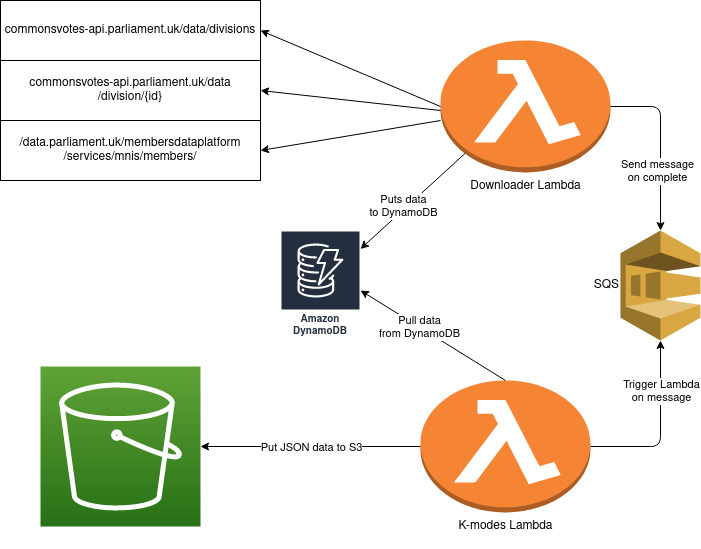

## VoteModes

### TL;DR

This project contains serverless applications that download House of Commons voting data
for use as input to a K-modes clustering algorithm.  

K-modes is implemented using Scala and deployed as an AWS Lambda.  

A Python application - also deployed as an AWS Lambda - performs the download and processing tasks.   

The outputs of the K-modes algorithm are converted to JSON and added to an S3 bucket.
Each application accesses a shared DynamoDB database.  

The above might beg the question: couldn't the whole process be handled by a single app? Answer: yes, but
that's no fun :)

### Infrastructure



### Downloader Lambda

The downloader Lambda application is triggered using as cron job on the 3rd day of 
each month.  

The data for each vote (division in HoC terminology) in the previous month is downloaded from the
`votes` endpoint.   

The data available from this endpoint does not contain the information the application
is actually interested in - the votes of each individual MP - so these
division ids are used get this data from the `vote` endpoint.   

To improve application performance, the voting data is downloaded in parallel.

One concern of the application was how to handle cases where the MP was not present
at the time of the vote. Rather than just counting 'for' and 'against' votes, I decided to
add 'did not attend'. In order to prevent low-attendance votes from polluting the results, only
those with > 60% attendance are considered.

### K-modes
Why?

### Example output
```json
{
    "Clusters": {
        "1": {
            "Mps": [
                {
                    "Name": "Arry Kane",
                    "Party": "Engerland"
                },
                {
                    "Name": "Mase",
                    "Party": "Engerland"
                },
                {
                    "Name": "Richard D James",
                    "Party": "Big Face"
                }
            ],
            "Stats": {
                "Engerland": 2,
                "Big Face": 1
            }
        },
        "2": {
            "Mps": [
                {
                    "Name": "David Lynch",
                    "Party": "Black Lodge"
                },
                {
                    "Name": "Dale Cooper",
                    "Party": "Black Lodge"
                },
                {
                    "Name": "Travolta",
                    "Party": "Royale With Cheese"
                }
            ],
            "Stats": {
                "Black Lodge": 2,
                "Royale With Cheese": 1
            }
        }
    }
}
```
